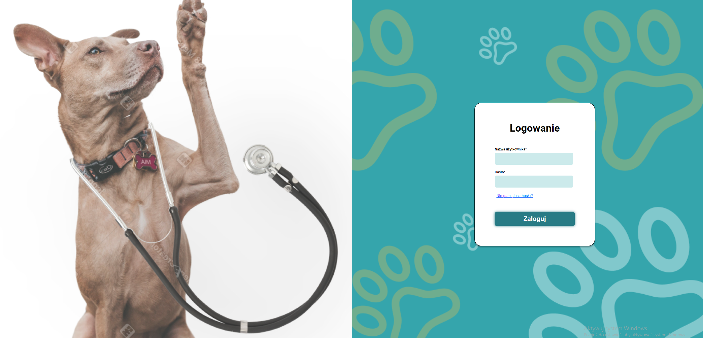
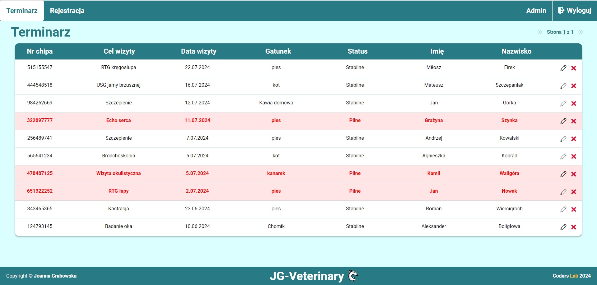
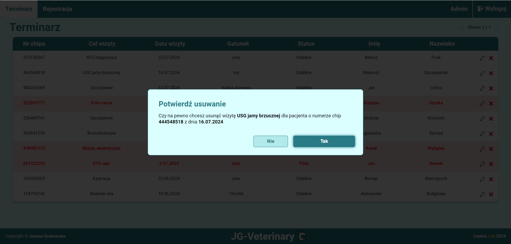
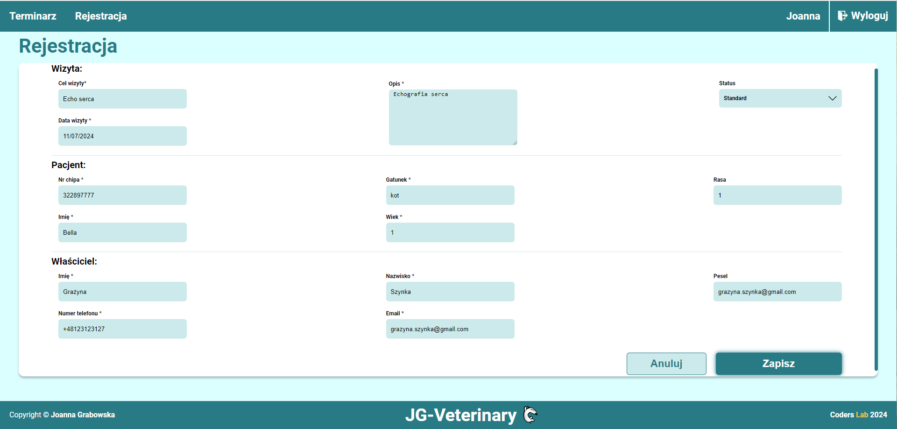
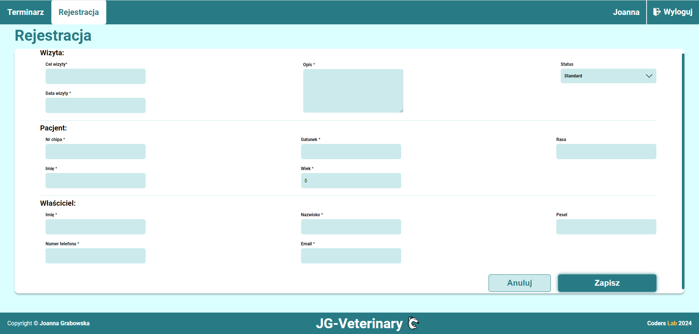

### JG-veterinary is the app to book visits for pets in a veterinary clinic.
### The project uses a simple backend in Java, PostgresSQL database and a frontend in React.

# Link to prototype:
[https://www.figma.com/proto/aAc1YUuwI2jxMIplsOKob1/Untitled?node-id=2-22&t=jGD36CfDeVasx8YQ-1&scaling=min-zoom&content-scaling=fixed&page-id=0%3A1](https://www.figma.com/proto/aAc1YUuwI2jxMIplsOKob1/Untitled?node-id=2-22&t=jGD36CfDeVasx8YQ-1&scaling=min-zoom&content-scaling=fixed&page-id=0%3A1)

### The entire environment can be set up using Docker by executing the following commands:

# Installation:

## Requires:
Docker Engine installed and started.

## Step 1:
Clone the Repository:
`git clone https://github.com/GrabowskaJoanna/jg-veterinary.git`

## Step 2:
Navigate to the project directory:
`cd jg-veterinary`

## Step 3:
Install Dependencies:
`npm install`

## Step 4:
In the project directory, use command `docker build -t jg-frontend .` to build the frontend docker image

## Step 5:
Navigate to the directory docker/backend and use the command `docker build -t jg-backend .` to build the backend Docker image.

## Step 6:
Navigate to the `docker`  directory and use `docker-compose -p jg up -d` to execute the command that will connect all services

## Used ports (localhost):
Backend: 7080,

Postgres: 7543,

Frontend: 3000,

## To get the username and password, please click on the link 'Nie pamiętasz hasła?' to display them in the console.

# Features:

* Routing (React Router)
* React with Hooks
* App state management by Redux toolkit
* Fetch to and from backend
* Webpack
* SessionStorage to save token and username
* Responsive Web Design (RWD)

# App description:

##### Login form:

### To get the username and password, please click on the link 'Nie pamiętasz hasła?' to display them in the console.

After logging in, you will navigate to the visit list, where you can delete or edit a visit. You can also navigate to the registration page to add a new visit.

##### Visit list

   

After clicking on the cross, you can show a modal where you can confirm that the record should be deleted.

##### Visit list - modal

You can also click on the pencil to edit the record.

##### Editing a visit

On this page, you can add a new visit. 

##### Registration

After logging out, you will be returned to the login form.

